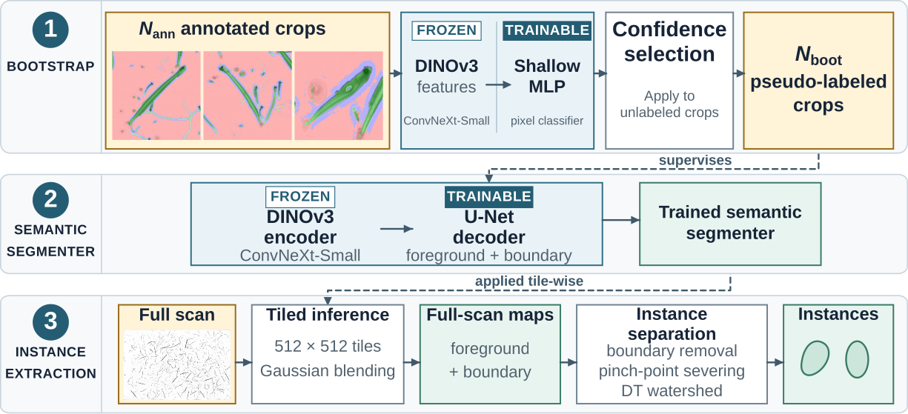

# Bootstrapped Watershed

**Few-shot instance segmentation for ZooScan plankton imagery — trained from three annotated crops.**

[](https://openreview.net/forum?id=u3dIljiYrj)
[](assets/poster.pdf)
[](https://ptea08.github.io/bw-watershed/)
[](LICENSE)
[](https://www.python.org/downloads/)

> Official implementation of *Bootstrapped Watershed: Towards Few-Shot Instance ZooScan Segmentation* — Marine Vision Workshop, ECCV 2026.
>
> Pratham Tatraiya, Torben Globisch, Vivian Fischbach, Stefan Oehmcke — University of Rostock, Germany

ZooScan digitizes whole plankton samples, but counting and measuring organisms requires separating each one from its neighbours — and a single scan can hold thousands of touching organisms. Manual annotation at that scale is slow and needs biological expertise.

Bootstrapped Watershed learns useful instance segmentation from **three** annotated crops. Frozen [DINOv3](https://huggingface.co/docs/transformers/model_doc/dinov3) features train a lightweight pixel classifier, whose most confident predictions become pseudo-labels for a stronger segmenter. Geometric post-processing then recovers individual organisms.



The conference poster is in this repository as [`assets/poster.pdf`](assets/poster.pdf).

---

## How it works

| Stage | What happens |
|---|---|
| **1. Bootstrap** | A frozen DINOv3 **ConvNeXt-Small** backbone gives a 384-d descriptor per spatial position. A two-layer MLP (384→128→3) trains on those descriptors from `N_ann = 3` annotated crops, predicts on unlabeled crops, and those scoring above a confidence threshold are kept as pseudo-labels — `N_boot = 82` cleared it in our experiments. |
| **2. Semantic segmenter** | Those pseudo-labels supervise a U-Net decoder on the same frozen backbone, now read at all four scales so the features feed the skip connections directly. Tversky (α=0.7, β=0.3) + weighted cross-entropy, with boundary weighted 8× — boundaries are rare but carry nearly all the separation signal. |
| **3. Instance extraction** | Full scans (~15000×25000 px) are processed as 512×512 tiles overlapping by 128 px with Gaussian blending. Boundary removal, pinch-point severing and a distance-transform watershed turn the semantic maps into instances. |

## Results

Macro-averaged over 15 held-out, independently annotated 1024×1024 crops from a scan never used in training or validation. Matching is one-to-one at IoU 0.5.

| Method | PQ | SQ | RQ | Precision | Recall | OSR |
|---|---|---|---|---|---|---|
| **MLP-S → ConvNeXt-UNet (ours)** | **0.310** | 0.709 | **0.435** | **0.368** | **0.573** | 1.76 |
| RF → ConvNeXt-UNet | 0.263 | **0.773** | 0.341 | 0.304 | 0.429 | 1.51 |
| MLP-D → ConvNeXt-UNet | 0.247 | 0.671 | 0.373 | 0.310 | 0.488 | 1.69 |
| U-Net only, no bootstrap (3 img) | 0.273 | 0.657 | 0.420 | 0.355 | 0.538 | 1.66 |
| EcoTaxa (threshold baseline) | 0.056 | 0.272 | 0.095 | 0.094 | 0.106 | 1.24 |
| CellPose + RF mask | 0.102 | 0.256 | 0.129 | 0.132 | 0.128 | **0.85** |
| StarDist + RF mask | 0.030 | 0.416 | 0.049 | 0.030 | 0.133 | 4.79 |
| CellPose (native, 3-img budget) | 0.000 | 0.000 | 0.000 | 0.000 | 0.000 | 0.26 |
| StarDist (native, 3-img budget) | 0.003 | 0.042 | 0.005 | 0.004 | 0.011 | 2.85 |
| Cellpose-SAM (zero-shot) | 0.000 | 0.000 | 0.000 | 0.000 | 0.000 | 1.61 |
| Mask2Former (Swin-T, zero-shot) | 0.171 | 0.504 | 0.224 | 0.323 | 0.202 | 0.60 |

Bootstrapping improves PQ by 0.037 and recall by 0.035 over training the same U-Net directly on the three crops. The best zero-training foundation-model baseline reaches 0.171 PQ and 0.202 recall.

**Known limitation.** OSR (over-segmentation ratio, `N_pred / N_gt`; ideal = 1) is **1.76**, so the higher recall comes with substantial over-segmentation — single organisms are frequently split. This is the main open problem.

## Installation

```bash
git clone https://github.com/ptea08/bw-watershed.git
cd bw-watershed
python -m venv .venv && source .venv/bin/activate
pip install -r requirements.txt
pip install -e .
```

The DINOv3 weights are **gated** on Hugging Face. Both stages share one checkpoint — request access to [`facebook/dinov3-convnext-small-pretrain-lvd1689m`](https://huggingface.co/facebook/dinov3-convnext-small-pretrain-lvd1689m), then:

```bash
export HF_TOKEN=hf_...     # never commit this
```

Baselines (Cellpose, StarDist, Mask2Former) have conflicting dependencies — install them in separate environments, see [`baselines/README.md`](baselines/README.md).

## Usage

No imagery ships with this repository (see [Data](#data)), so the commands below
assume you have arranged your own scans in the layout given there.

```bash
# 1. bootstrap pseudo-labels from the annotated crops
python scripts/bootstrap.py --data-root data/ --output-dir outputs/bootstrap

# 2. train the segmenter on them
python scripts/train.py --bootstrap-dir outputs/bootstrap --output-dir outputs/segmenter

# 3. tiled inference + instance extraction
python scripts/infer.py --checkpoint outputs/segmenter/best.pt \
    --scan path/to/scan.png --output-dir outputs/instances

# 4. metrics
python scripts/evaluate.py --pred-dir outputs/instances --gt-dir data/test --markdown
```

A CPU-only test suite covers the pieces that do not need weights or data:

```bash
pip install -e ".[dev]"
pytest
```

Those are unit tests, so they say nothing about whether the four stages hand off
to each other on your machine. To check that, generate throwaway data and run
the whole thing under a shortened config:

```bash
python scripts/make_synthetic_data.py --output-dir data/synthetic
python scripts/bootstrap.py --config configs/smoke.yaml \
    --data-root data/synthetic --output-dir outputs/smoke/bootstrap
```

The generated crops are ellipses, not organisms, and the metrics that fall out
are meaningless — the only question it answers is whether the pipeline runs.
[`RUN.md`](RUN.md) §2 has the remaining steps.

Every constant lives in [`configs/default.yaml`](configs/default.yaml); paths are always passed on the command line. Change behaviour there rather than in the source.

Don't edit that file directly, though — write a small overlay containing only what you're changing and pass it with `--config`. It's merged over the defaults at any depth, so everything you leave out keeps its published value:

```yaml
# my_data.yaml
data:
  class_weights:
    boundary: 4.0
```

**If you are running this on your own imagery, read [`docs/TUNING.md`](docs/TUNING.md) first.** Some of the defaults are the published method and should not be touched; others are pixel measurements or class balances taken from ZooScan data, and will be wrong for you. That page says which is which — and in particular explains `min_instance_area`, which silently discards anything smaller than 150 px².

[`RUN.md`](RUN.md) walks through the same steps in detail, with what to check between them.

## Data

The dataset — 20 ZooScan scans of Baltic Sea plankton samples — was produced by the **Thünen Institute of Baltic Sea Fisheries** and is **not redistributable**. No imagery is included in this repository, and the results table above therefore cannot be reproduced from a clone alone. The code is published so the method can be inspected and applied to other ZooScan data.

Expected layout for your own data:

```
data/
├── annotated/     # N_ann manually annotated 512x512 crops + RGB masks
├── unlabeled/     # candidate pool for pseudo-labeling
├── test/          # held-out 1024x1024 crops + masks
└── scans/         # full ~15000x25000 px scans
```

Masks are RGB: **red** = background, **green** = organism interior, **blue** = boundary. Full details, including the evaluation ground-truth formats, are in [`data/README.md`](data/README.md).

## Citation

```bibtex
@inproceedings{tatraiya2026bootstrapped,
  title     = {Bootstrapped Watershed: Towards Few-Shot Instance ZooScan Segmentation},
  author    = {Pratham Tatraiya and Torben Globisch and Vivian Fischbach and Stefan Oehmcke},
  booktitle = {2nd Workshop on Marine Vision},
  year      = {2026},
  url       = {https://openreview.net/forum?id=u3dIljiYrj}
}
```

## Acknowledgements

Thanks to Dr. Patrick Polte and the crew of RV *Clupea* for the ZooScans, provided by the Thünen Institute of Baltic Sea Fisheries. Built on [DINOv3](https://github.com/facebookresearch/dinov3); baselines use [Cellpose](https://github.com/MouseLand/cellpose), [StarDist](https://github.com/stardist/stardist) and [Mask2Former](https://github.com/facebookresearch/Mask2Former).

## License

Apache 2.0 — see [LICENSE](LICENSE). This is research code, released as-is, with
no promise of maintenance, support or future updates.

The DINOv3 backbone is not covered by this licence. The weights are governed by
Meta's [DINOv3 License](https://ai.meta.com/resources/models-and-libraries/dinov3-license/),
which you accept when requesting access on Hugging Face and which also governs
any redistribution of the weights or of derivatives of them.
